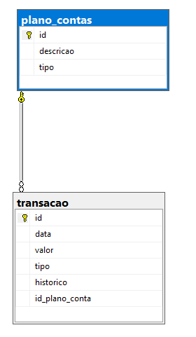

## Sobre My Finance Web App
MyFinance - Projeto do Curso de Pós Graduação em Engenharia de Software da PUC-MG, nesse projeto será utilizada a stack dotnet e sql server db. O script pra a criação das entidades se encontra na sessão Script Database

# Índice 

* [Arquitetura](#Arquitetura)
* [Script](#ScriptDatabase)

### Arquitetura
A figura abaixo representa a modelagem lógica do banco de dados da aplicação no modelo de DER - Diagrama de Entidades e Relacionamentos.

### Script Database

create database db_myfinance

use db_myfinance

create table plano_contas(
    id int identity(1,1) not null,
    descricao varchar(50) not null,
    tipo char(1) not null,
    primary key(id)
)

create table transacao(
    id bigint identity(1,1) not null,
    data datetime not null,
    valor decimal(18,2) not null,
    tipo char(1) not null,
    historico text null,
    id_plano_conta int not null,
    primary key(id),
    foreign key(id_plano_conta) references plano_contas
)
